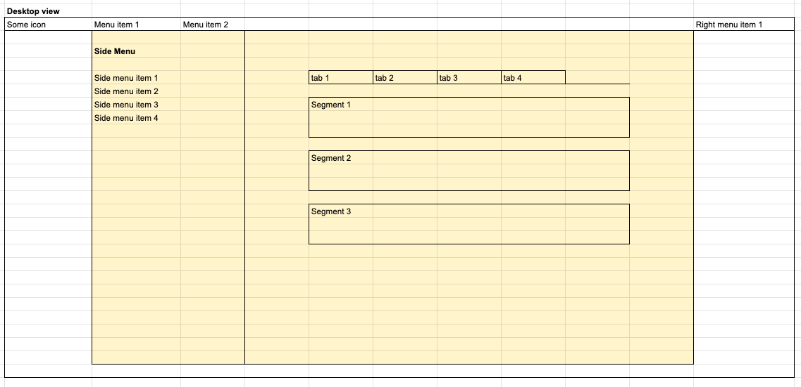
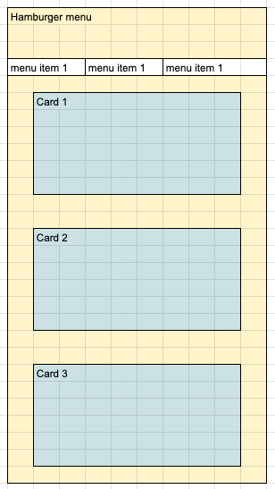

# Semantic mastery

Semantic has predefined modules and elements which can make designing pages much easier. To effectively use semantic  
  
- Map out the elements and modules - know what all exists
- Learn to use the elements together well  

This is where you try out every single option in semantic. 
Challenge definition:
Get yourself familiar with Semantic. You need to be able to use semantic ui to build any front end interaction. 

You will be evaluated based on:
- Your ability to [quickly pick up elements from semantic](semantic/semantic_elements.md)
- Your ability to come up standard patterns    

Find detailed references at https://semantic-ui.com/   

## Level 1 - Basics  
### Try out  

- Elements
	- Form
		- Fields
			- Dropdowns
			- Text Input
			- Checkbox
		- Button
	- Navigation
		- Menu
		- Breadcrumbs
		- Tabs
	- Layout
		- segments
		- grids
- Design
	- Mobile responsive
	- Gridded pages
- APIs
	- Form validation

### Challenges
#### 1. Build a form
Fields:
- Name -  Text
- Email - Email
- Gender - Dropdown
	- Make this mandatory to select. Give an error message if not selected
	- By default nothing will be selected. Default text is "Select gender"
- Opt in for newsletters - checkbox
- Color: Radio button with red, blue and green as options

- Submit button

Expected request body:
`{
	name:"",
	email:"",
	gender:"",//male/female
	opt_in_for_nl:"",//on/off
    color: "",
 }`

#### 2. Build a listing page

## Level 2 - Polish

### Try out
- Image
- Popus
- Modal
- Messages
- Loader
- Breadcrumbs
- Sidebar

### Challenges

## Level 3 - Advanced
### Try out
- sticky
- accordion
- reveal
- progress
- rating
- shape
### Challenges